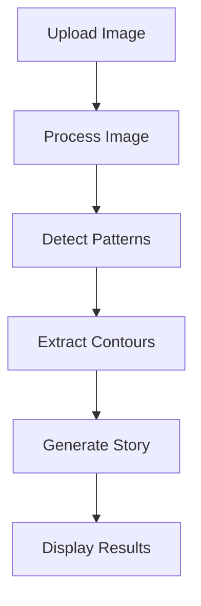

# Intrusive Thoughts Generator 🎯

## Basic Details
### Team Name: MightCompile
### Team Members:
 - Team Lead: Athishta P A - MITS, Varikoli
 - Member 2 : Harikesh R Menon - MITS, Varikoli

### Project Description
Ever looked at a coffee stain and thought it looked like a dragon? Or seen faces in the clouds? This project turns that delightful human tendency to find patterns into an AI-powered storytelling adventure! We take any image, extract its interesting patterns, and let AI weave creative tales about what it "sees."

### The Problem (that doesn't exist)
People are spending too much time being productive and not enough time finding stories in random patterns! Why should cloud-watching be limited to actual clouds? What about the epic tales hidden in your coffee stains, crumpled papers, or random photographs?

### The Solution (that nobody asked for)
We built an AI-powered "Professional Pattern Storyteller" that:
1. Takes any image and finds interesting patterns in it
2. Transforms these patterns into high-contrast white lines on a black background
3. Uses Groq AI to create whimsical stories about what it sees
4. Engages in a playful conversation about the details it noticed

It's like having a creative writing partner who's always ready to turn mundane patterns into magical stories!

## Technical Details
### Technologies Used
- **Python**: Core programming language
- **OpenCV (cv2)**: Image processing and pattern detection
- **Streamlit**: Web interface and user interaction
- **Groq AI**: Creative story generation
- **PIL (Python Imaging Library)**: Image handling
- **NumPy**: Numerical operations for image processing
- **python-dotenv**: Environment variable management

### Key Components
1. **Image Processing** (`image_cleaning.py`):
   - Converts images to grayscale
   - Applies Gaussian blur for noise reduction
   - Detects edges using Canny algorithm
   - Creates high-contrast contour images

2. **Story Generation** (`groq_interpretation.py`):
   - Processes images for AI interpretation
   - Crafts detailed prompts for the AI
   - Generates creative stories and conversations

3. **User Interface** (`main.py`):
   - Handles image uploads
   - Manages the application flow
   - Displays results in an engaging format

### Implementation

The project follows a multi-stage pipeline to transform ordinary images into engaging stories:

#### 1. Image Processing Pipeline
First, we process the input image using OpenCV to extract meaningful patterns:

#### 2. Contour Enhancement
We create a high-contrast visualization of the detected patterns:
- Generate a black background
- Draw white contours for maximum visibility
- Apply slight dilation to make lines more prominent
- Save as a clean, binary image

#### 3. Story Generation with Groq
We use Llama model through Groq's API for creative interpretation:
- Convert the processed image to base64
- Craft a detailed prompt that guides the AI to:
  - Observe actual patterns in the image
  - Create stories based on visible shapes
  - Generate natural conversations about details
- Process the response into a structured format

#### 4. User Interface
We used streamlit to provide an intuitive flow:
1. Image upload and preview
2. One-click processing
3. Display of:
   - Original image
   - Detected patterns
   - Generated story
   - Interactive conversation

#### Prerequisites
- Python 3.8 or higher
- Groq API key
- OpenCV

#### Installation
```bash
# Clone the repository
git clone https://github.com/AsherWood39/TinkerHub_Useless_Project_2_0.git

# Navigate to project directory
cd TinkerHub_Useless_Project_2_0

# Create and activate virtual environment
python -m venv venv
source venv/bin/activate  # For Linux/Mac
# or
.\venv\Scripts\activate  # For Windows

# Install requirements
pip install -r requirements.txt

# Set up environment variables
# Create a .env file and add your Groq API key:
echo "GROQ_API_KEY=your_key_here" > .env
```

#### Run the Application
```bash
streamlit run main.py
```

### Project Documentation

#### Screenshots

*The main interface where users can upload their images*


*Example of pattern detection on a coffee stain image*


*AI-generated story with conversation about the detected patterns*

#### Project Workflow


#### Key Features
1. **Pattern Detection**
   - Edge detection using Canny algorithm
   - Contour extraction and enhancement
   - High-contrast visualization

2. **Story Generation**
   - Pattern-based prompt engineering
   - Creative narrative generation
   - Interactive conversation format

3. **User Experience**
   - Simple, intuitive interface
   - Real-time processing
   - Engaging result presentation

### Project Demo

#### Video Demo
[Watch the Demo](link_to_your_demo)
*See the Intrusive Thoughts Generator in action, transforming everyday patterns into extraordinary stories!*

# Additional Demos
[Link to the Live Demo Hosted in Streamlit](https://tinkerappuselessproject20-f2bg8tneaxdphqizzf55qd.streamlit.app/)

#### Try it yourself!
1. Upload any image
2. Watch as the AI detects interesting patterns
3. Enjoy the creative story it generates
4. Engage with the AI's observations about the details

## Team Contributions
- Athishta P A: Research, Development, Deployment
- Harikesh R Menon: Research, AI, LLMs

### Future Enhancements
1. **Pattern Recognition**
   - Improved edge detection algorithms
   - Multiple pattern detection modes
   - Pattern categorization

2. **Story Generation**
   - Multiple storytelling styles
   - Theme-based narratives
   - Interactive story development

3. **User Experience**
   - Pattern highlight overlay
   - Story collection gallery
   - Social sharing features

---
Made with ❤️ at TinkerHub Useless Projects 


